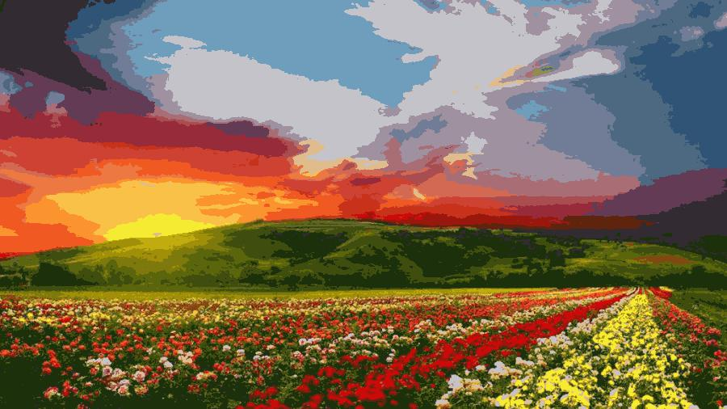

# Kmeans-Clustering 
Kmeans clustering both from scratch and using sklearn library. 
kmeans_image is applied to an image file and reduces the number of colors in the image by the number k. 
original image: 
 
after applying Kmeans:
 
